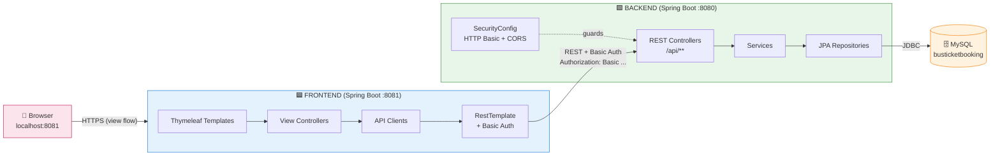
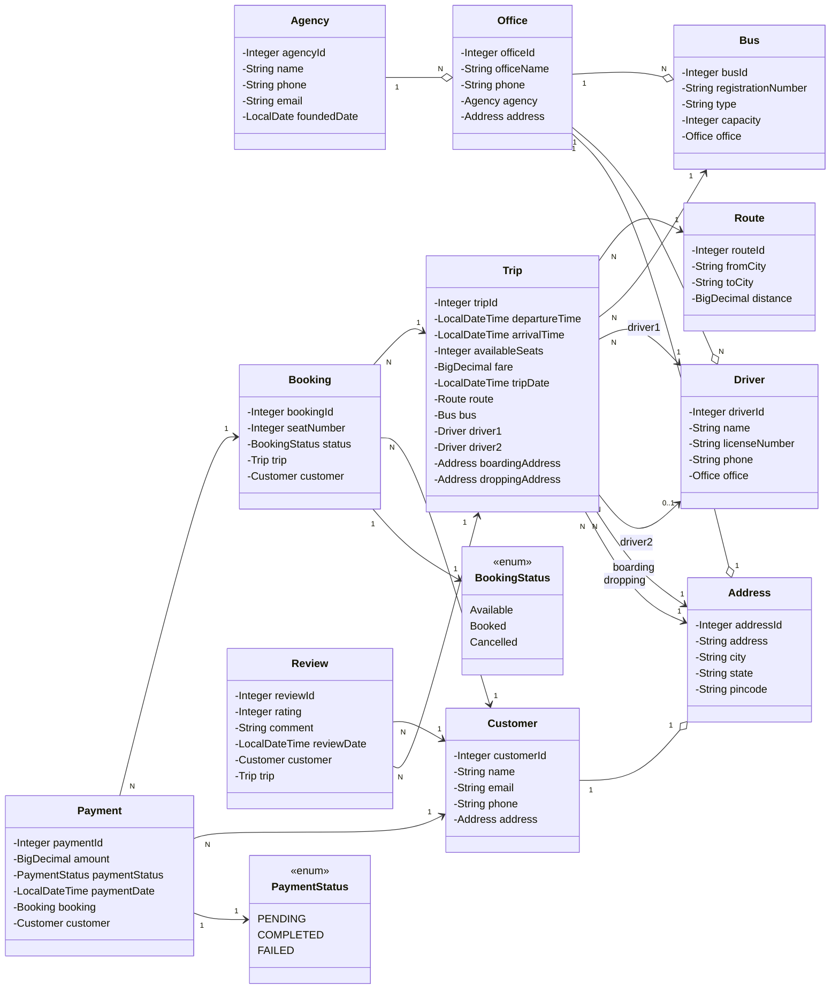
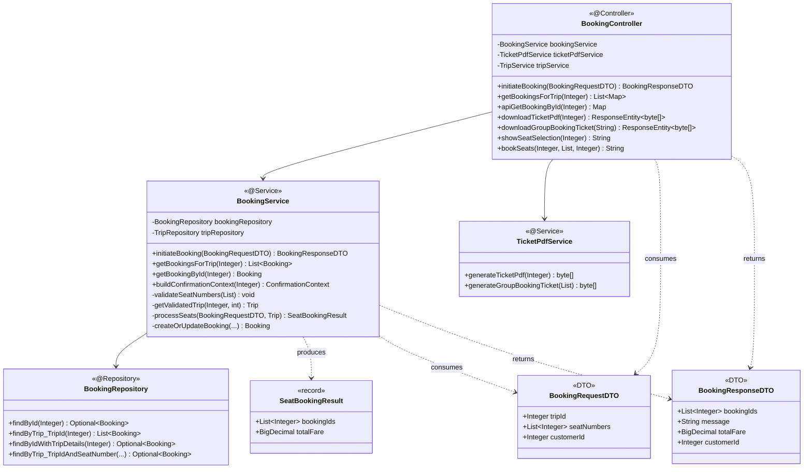
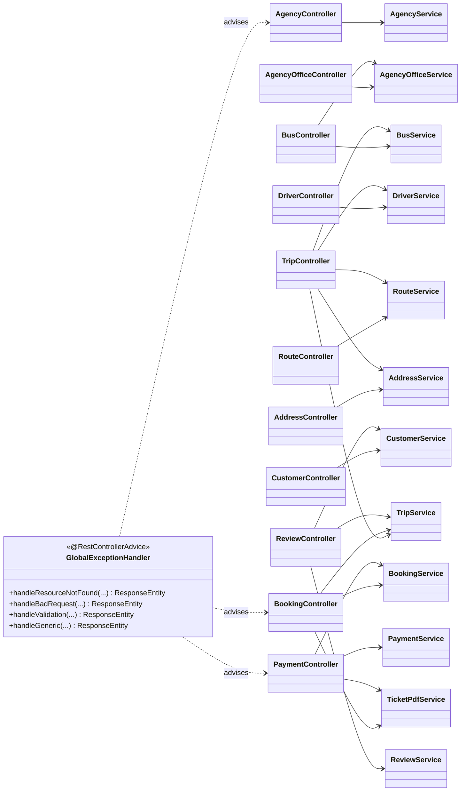
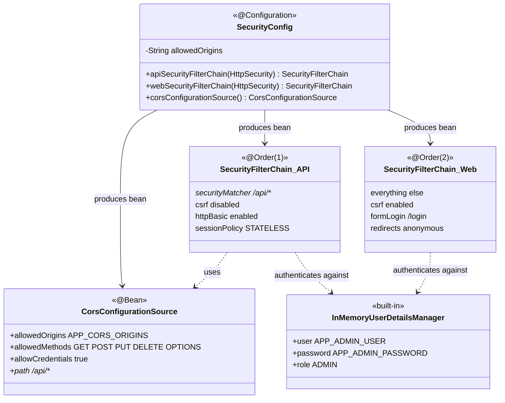
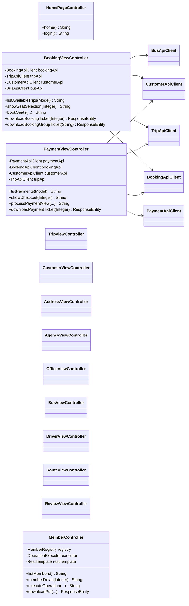
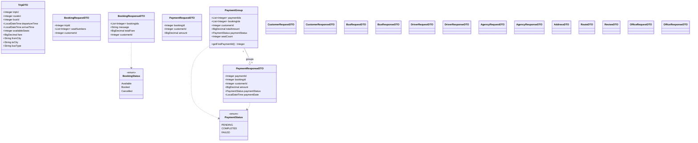
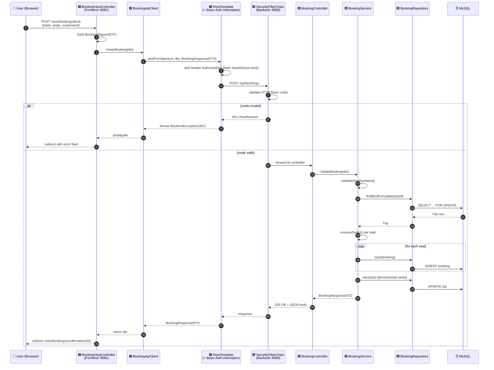

# 🚌 Bus Ticket Booking System — Class Diagrams (Mermaid)

> **Use for presentations:** open this file in any Mermaid-compatible viewer (GitHub preview, VS Code + Mermaid plugin, Typora, Obsidian, or paste into https://mermaid.live). Each diagram renders automatically.

> **Architecture:** Distributed 2-tier Spring Boot split — **Backend** (`:8080`, REST API + JPA + MySQL) and **Frontend** (`:8081`, Thymeleaf + RestTemplate). Browser never talks to backend directly.

---

## Table of Contents

1. [System Overview (High-Level)](#1-system-overview-high-level)
2. [Backend — Domain Entities](#2-backend--domain-entities-jpa)
3. [Backend — Layered Architecture (one module deep dive: Booking)](#3-backend--layered-architecture-booking-module-deep-dive)
4. [Backend — All REST Controllers & Services](#4-backend--all-rest-controllers--services)
5. [Backend — Security & Config](#5-backend--security--config-round-4-hardening)
6. [Frontend — API Client Hierarchy](#6-frontend--api-client-hierarchy)
7. [Frontend — View Controllers](#7-frontend--view-controllers)
8. [Frontend — DTO Layer](#8-frontend--dto-layer)
9. [Cross-System Integration (Frontend ↔ Backend)](#9-cross-system-integration-frontend--backend)
10. [Request Flow — Booking a Seat (Sequence Diagram)](#10-request-flow--booking-a-seat-sequence-diagram)
11. [Security Flow — HTTP Basic + CORS (Sequence Diagram)](#11-security-flow--http-basic--cors-sequence-diagram)

---

## 1. System Overview (High-Level)



---

## 2. Backend — Domain Entities (JPA)



---

## 3. Backend — Layered Architecture (Booking module deep-dive)



---

## 4. Backend — All REST Controllers & Services



---

## 5. Backend — Security & Config (Round 4 Hardening)



---

## 6. Frontend — API Client Hierarchy

```mermaid
classDiagram
    direction TB

    class AbstractApiClient {
        <<abstract>>
        #RestTemplate restTemplate
        #String baseUrl
        #url(String) String
        #get(String, Class) T
        #getList(String, TypeReference) List~T~
        #post(String, B, Class) T
        #put(String, B, Class) T
        #delete(String) void
        #getBytes(String) byte[]
        -translate(Exception) BackendException
        -extractMessage(String, String) String
    }

    class BookingApiClient {
        +createBooking(BookingRequestDTO) BookingResponseDTO
        +getByTrip(Integer) List~Map~
        +getById(Integer) Map
        +downloadTicket(Integer) byte[]
        +downloadGroupTicket(List) byte[]
    }

    class TripApiClient {
        +getAllTrips() List~TripDTO~
        +getById(Integer) TripDTO
        +searchTrips(String, String) List~TripDTO~
    }

    class CustomerApiClient {
        +getAll() List~CustomerResponseDTO~
        +getById(Integer) CustomerResponseDTO
        +create(CustomerRequestDTO) CustomerResponseDTO
    }

    class PaymentApiClient {
        +getAll() List~PaymentResponseDTO~
        +getById(Integer) PaymentResponseDTO
        +processPayment(PaymentRequestDTO) PaymentResponseDTO
        +downloadTicketByPaymentId(Integer) byte[]
        +downloadGroupTicket(List) byte[]
    }

    class BusApiClient
    class DriverApiClient
    class AgencyApiClient
    class AgencyOfficeApiClient
    class AddressApiClient
    class RouteApiClient
    class ReviewApiClient

    class BackendException {
        <<RuntimeException>>
        -int status
        -String message
        +getStatus() int
    }

    AbstractApiClient <|-- BookingApiClient
    AbstractApiClient <|-- TripApiClient
    AbstractApiClient <|-- CustomerApiClient
    AbstractApiClient <|-- PaymentApiClient
    AbstractApiClient <|-- BusApiClient
    AbstractApiClient <|-- DriverApiClient
    AbstractApiClient <|-- AgencyApiClient
    AbstractApiClient <|-- AgencyOfficeApiClient
    AbstractApiClient <|-- AddressApiClient
    AbstractApiClient <|-- RouteApiClient
    AbstractApiClient <|-- ReviewApiClient
    AbstractApiClient ..> BackendException : throws
```



---

## 7. Frontend — View Controllers



---

## 8. Frontend — DTO Layer



---

## 9. Cross-System Integration (Frontend ↔ Backend)

```mermaid
classDiagram
    direction LR

    namespace Frontend {
        class RestClientConfig {
            <<@Configuration>>
            -long connectTimeoutMs
            -long readTimeoutMs
            -String backendUsername
            -String backendPassword
            +restTemplate(RestTemplateBuilder) RestTemplate
        }

        class AbstractApiClient {
            <<abstract>>
            #RestTemplate restTemplate
            #String baseUrl
        }

        class BookingApiClient {
            +createBooking(BookingRequestDTO) BookingResponseDTO
        }

        class BookingViewController_FE {
            +bookSeats(...) String
        }
    }

    namespace Backend {
        class SecurityFilterChain_API_BE {
            <<@Order(1)>>
            httpBasic
            STATELESS
        }

        class BookingController_BE {
            <<@RestController>>
            +initiateBooking(BookingRequestDTO) BookingResponseDTO
        }

        class BookingService_BE {
            <<@Service>>
            +initiateBooking(...) BookingResponseDTO
        }

        class BookingRepository_BE {
            <<@Repository>>
        }
    }

    class MySQL_DB {
        <<database>>
        busticketbooking
        JDBC
    }

    RestClientConfig ..> AbstractApiClient : provides RestTemplate
    BookingViewController_FE --> BookingApiClient
    BookingApiClient --|> AbstractApiClient
    AbstractApiClient -->|"HTTP POST /api/bookings<br/>Authorization: Basic ..."| SecurityFilterChain_API_BE : "REST over HTTP"
    SecurityFilterChain_API_BE -->|"Authorized"| BookingController_BE
    BookingController_BE --> BookingService_BE
    BookingService_BE --> BookingRepository_BE
    BookingRepository_BE -->|JDBC| MySQL_DB
```

---

## 10. Request Flow — Booking a Seat (Sequence Diagram)



---

## 11. Security Flow — HTTP Basic + CORS (Sequence Diagram)

```mermaid
sequenceDiagram
    autonumber
    participant RT as 🟦 Frontend RestTemplate
    participant CORS as 🟩 CorsFilter
    participant AUTH as 🟩 BasicAuthenticationFilter
    participant AUTHZ as 🟩 AuthorizationFilter
    participant CTL as 🟩 REST Controller

    Note over RT,CTL: Two chains: /api/** uses this one;<br/>everything else uses webSecurityFilterChain (form login)

    RT->>CORS: GET /api/trips<br/>Origin: http://localhost:8081<br/>Authorization: Basic YWRtaW46cHdk
    CORS->>CORS: check origin against<br/>APP_CORS_ORIGINS allowlist

    alt origin blocked
        CORS-->>RT: reject (no CORS headers)
    else origin allowed
        CORS->>AUTH: forward with CORS headers
        AUTH->>AUTH: decode base64(user:pwd)
        AUTH->>AUTH: check InMemoryUserDetailsManager

        alt creds invalid
            AUTH-->>RT: 401 WWW-Authenticate: Basic realm=...
        else creds valid
            AUTH->>AUTHZ: set SecurityContext
            AUTHZ->>AUTHZ: check /api/** → authenticated() ✓
            AUTHZ->>CTL: forward to controller
            CTL-->>AUTHZ: 200 OK + JSON
            AUTHZ-->>AUTH: response
            AUTH-->>CORS: response
            CORS-->>RT: 200 OK<br/>Access-Control-Allow-Origin: http://localhost:8081<br/>Access-Control-Allow-Credentials: true
        end
    end
```

---

## 📝 Tips for Your Presentation

1. **Start with Diagram 1 (System Overview)** — gives the big picture in 10 seconds.
2. **Show Diagram 2 (Entities)** next — proves you understand the domain.
3. **Use Diagram 3 (Booking module layered)** to demonstrate clean architecture.
4. **Diagram 6 (API Client hierarchy)** proves DRY / inheritance on the frontend.
5. **Close with Diagrams 10 + 11 (sequence diagrams)** — these turn static boxes into a runtime story, which is what examiners remember.
6. **Skip Diagrams 4, 7, 8** if time is short — they're reference material, not storytelling material.

## How to Render

| Tool | How |
|---|---|
| **GitHub** | Commit the `.md` — Mermaid renders automatically in preview. |
| **VS Code** | Install extension `Markdown Preview Mermaid Support`, then `Ctrl+Shift+V`. |
| **Typora / Obsidian** | Native support — opens straight away. |
| **Export to PNG/SVG** | Paste each diagram at https://mermaid.live, click "Actions → PNG / SVG". |
| **In PowerPoint** | Export each as PNG from mermaid.live, paste into slides. |

---

**File location:** `C:\Users\Sarthak\OneDrive\Desktop\Bus-Ticket-Class-Diagrams.md`

**Total diagrams:** 11 (1 flowchart + 7 class diagrams + 2 sequence diagrams + 1 cross-system integration diagram)

**Coverage:** All 12 backend REST controllers, 11 backend services, 11 JPA entities, 11 frontend API clients, 12 frontend view controllers, 24+ DTOs, Security (Round-4) config, and full request-path trace from browser to MySQL.

